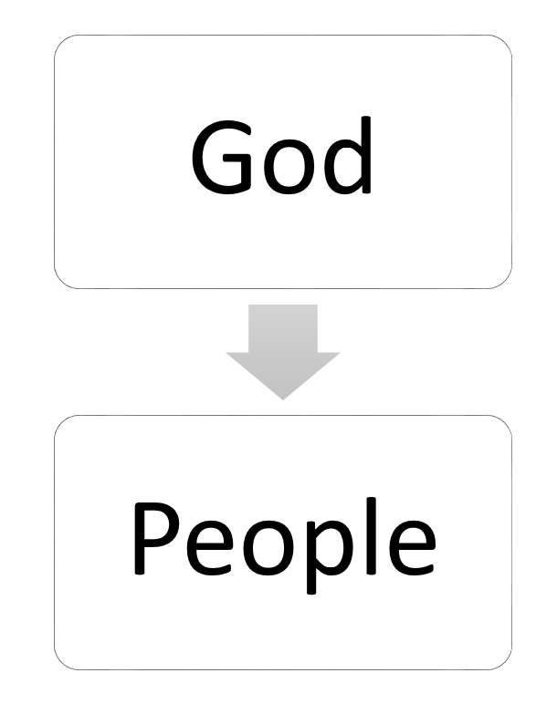
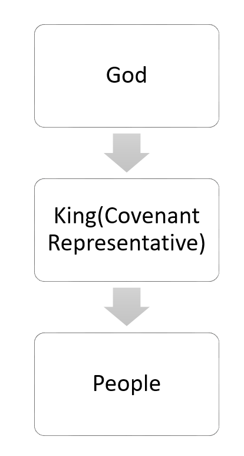
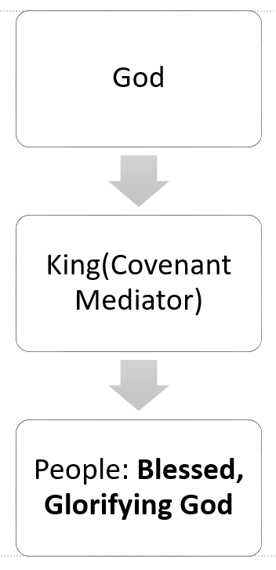
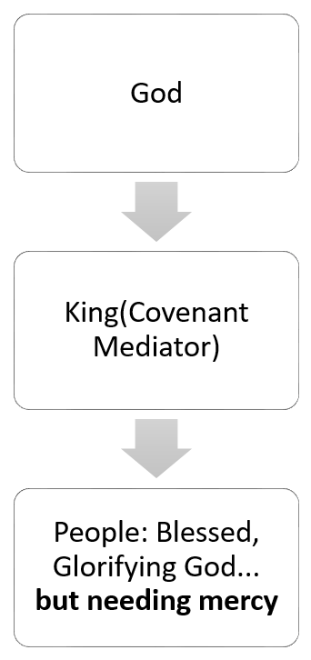
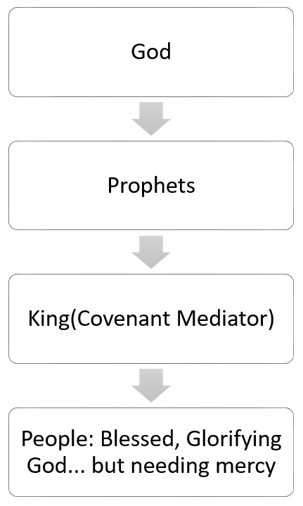

# Introduction

Welcome to the second half of the Old Testament class!  So far we’ve worked our way through Israel’s history up through David and then side-stepped into the wisdom literature: Job, Psalms, and Proverbs — essentially the wisdom required by Israel’s kings to act as the rulers of God’s people on God’s behalf.  This morning, we finish up the wisdom literature with Ecclesiastes and the Song of Songs and then return to the historical books with 1 and 2 Kings.

Now, if Proverbs and the Song of Songs in general give us wisdom for operating in the world that should be, the world of Genesis 2, Ecclesiastes is commentary on the world of Genesis 3.  The world of the fall.  What does it look like to search for meaning in a world wracked by sin?  That’s Ecclesiastes.

One thing the first two books have in common is how easy it is in both books to get lost in the twists and turns and miss the main message.  That’s why Ecclesiastes and the Song are often mined for pithy quotes but rarely understood as whole books.  So it’s our goal today to try to understand the author's intent in writing, and the one point he’s trying to make in each book.

# ECCLESIASTES

## Context

First, some context.  Chapter 1, verses 1 and 12 tell us that the author was a son of David[^1].  Which one?  It could have been Solomon or a much later descendant.  But with nothing historically to place him in the book ends up having a timeless presence among us, not dissimilar to Job.  So how do we establish some context for this book within redemptive history?  

A few thoughts for you.  First, we can think of this book as a how-to guide to life in a fallen world.  In that sense, it sits atop the story line of redemptive history, applicable to all time.  Second, we can think of this book as it was used by the first compilers of the Old Testament.  Though not inspired, this tradition is nonetheless informative.  In that initial ordering, the ordering that Jesus would have been taught, Ecclesiastes sits near the end of the Bible with material written after the exile, between Esther and Daniel, Ezra, and Nehemiah.  In that sense, Ecclesiastes may have been positioned as an answer to the meaninglessness life in and after exile.  It gets to the existential questions raised by a people who had lost their land, their temple, their nationhood, and as a result, their identity.

## Theme

Like Job, Ecclesiastes first poses a problem then gives the solution.  The question sounds like this:

_What is the meaning of life?  Isn’t it all fleeting, empty, pointless, and vain since we are all just racing towards death anyway?_

To quote chapter 1, starting in verse 2:  “Vanity of vanities, says the Preacher, vanity of vanities! All is vanity.
What does man gain by all the toil at which he toils under the sun?”  And skipping down to verse 11: “There is no remembrance of former things, nor will there be any remembrance of later things yet to be among those who come after.”

Is everything meaningless?  Is everything vanity?  It’s a serious question.  As Robert Gordis has written, “Whoever has dreamed great dreams in his youth and seen the vision flee, or has loved and lost or has beaten barehanded at the fortress of injustice and come back bleeding and broken, has passed [the Teacher’s] door, and tarried a while beneath the shadow of his roof.”[^2]

So here’s a summary of this book’s answer:

_Meaningful!  Meaningful!  All is meaningful because all is ordered by an eternal, sovereign, and purposeful God.  Therefore, we should fear God and rejoice in what He has given us to do and to have._

Ecclesiastes confronts our attempt to find meaning in the creation apart from the Creator.  It comes to the sobering conclusion that without a sovereign Creator God, all _is_ vanity.  But if the universe was created, and is now governed, by an eternal, sovereign, and purposeful God, then there _is_ great meaning and value to life.  Now, notice I didn’t just say that the universe has meaning simply because God has meaning.  I said it has meaning because God has certain attributes.  Eternal, sovereign, and purposeful.  Not just any ol’ god will do.  Only if God ordains all things that come to pass, and has the power to carry out His plans, can anything temporal, like our lives, have lasting, meaningful significance.  The God of Ecclesiastes _is_ a sovereign God, and so everything is significant because God does nothing without reason.  Therefore, God is to be feared, and all things that He gives us are to be enjoyed.  After all, He has good and meaningful reasons to give them to us.  This includes our jobs and homes and families and so forth.  But it also includes our troubles and afflictions.  These too are meaningful and good.  We may not understand how.  But we are called to trust God, and believe that He’s not making any mistakes.

Now.  I began with the first words of the book declaring everything meaningless.  And I told you that the message of the book is that everything is meaningful under an eternal, sovereign, and purposeful God.  How did I get from point A to point B?  Let me give you an overview of the book’s structure to explain.

## Structure and Outline

The book begins with the section I was just reading with an introduction that essentially works as an antithesis.  All is vain.  Incidentally, the skeptical honesty of this book is powerful and refreshing.  This is how all of us sometimes feel.  Praise God that he’s constructed a piece of his word to draw us from cynicism back to Christ and to faith.  Look at page 3 of your handout and you can see how the book works its way out of cynicism.

Note that with this introduction completed, the book shifts from third-person — talking about the Teacher — to first person — the words of the Teacher.  We’ll flip back to third-person in the last chapter for the epilogue.

The next chapters go back and forth in answering this basic objection.  We begin with proof in chapter 2 that all is indeed in vain: the Teacher has tried everything yet without meaning.  And then at the end of chapter 2, we see the book’s thesis.  All is meaningful if a sovereign God rules the universe.  That thesis is defended, objected to, defended, and then finally we reach a conclusion in the epilogue, chapter 12.  What is the conclusion of the matter?  Verse 13.  “The end of the matter; all has been heard. Fear God and keep his commandments, for this is the whole duty of man.  For God will bring every deed into judgment, with every secret thing, whether good or evil.”

Let me walk you through this so you can see how this book makes its argument with a single flow of thought.

### 1:1-2:23

As I mentioned before, the opening two chapters are an exploration of what the meaning of life might be.  With the intro behind us, the Teacher gives us a tour of his pursuit of meaning apart from God.  That’s the rest of chapter 1 and most of chapter 2.  He looks for significance in wisdom, wine, laughter, riches, delicacies, his work, his projects, sex, power, fame, and full material gluttony.  If he wanted it, he got it.  Chapter 2, verse 10: “And whatever my eyes desired I did not keep from them. I kept my heart from no pleasure, for my heart found pleasure in all my toil, and this was my reward for all my toil.  Then I considered all that my hands had done and the toil I had expended in doing it, and behold, all was vanity and a striving after wind, and there was nothing to be gained under the sun.”

His quest for meaning was no more successful than an attempt to grab the wind.
  
And the effect of such a bleak outlook?  Verse 17 tells us that the Teacher _hated life_.  And no wonder!  Even the worldly enjoyments he had all eventually came to an end.  Everything ends; everything dies.  It’s amazing anyone ever manages a smile!  

Which brings us to verse 24 in chapter 2.

### 2:24-26

Now remember, the flow of thought is important.  Nothing that man can do between birth and death has any lasting significance.  Therefore it has no value.  But now in __verses 24 through 26__ he’s going to lay out the solution to this apparent vanity of everything under the sun.  “There is nothing better for a person than that he should eat and drink and find enjoyment in his toil. This also, I saw, is from the hand of God, for apart from him who can eat or who can have enjoyment?  For to the one who pleases him God has given wisdom and knowledge and joy, but to the sinner he has given the business of gathering and collecting, only to give to one who pleases God. This also is vanity and a striving after wind.”

What a change in outlook!  We see words like “better” and “enjoyment” and “from the hand of God” and “knowledge” and “joy.”  A long way from “vanity” and “striving after the wind.”  What’s changed?  Same facts, same life.  But now a new perspective because now this is life with God.

Let’s read __verse 24__ again.  “There is nothing better for a person than that he should eat and drink and find enjoyment in his toil. This also, I saw, is from the hand of God.”  Notice he says that the best thing a man can do is to eat and drink and enjoy his work.  I thought he just said that all that was vanity.  Why does he now _recommend_ work?  How can he say there can be, and ought to be, satisfaction and joy in all of life?  That’s what “eat and drink” means.  It’s a metaphor to mean “everything one does,” for eating and drinking are the base of all activities.  So you should live life, and be happy, and actually enjoy the labor of your hands.  Can that really be what he’s saying?  What’s the catch?  Well the catch is in the rest of the verse.  “This also, I saw, is from the hand of God.”  The author has seen many things in chapters 1 and 2.  But there is one other thing he has seen.  That “eating and drinking,”--that is to say--“the living of life” _comes from the hand of God_.  Well, this changes _everything_!

Before (that is, 1:1 through 2:23) the author looked at life through the lens of the natural man.  And we can understand this.  He was simply reporting what he’d seen.  And when that was the only information-gathering instrument used, his conclusions were sound, though pessimistic.  But, once he remembered the _Creator_, life then took on a different origin, purpose, means, and end.  How can what was vanity now have meaning?  Well, it’s because the origin of every activity one undertakes is from the very hand of an eternal and meaningful God.  The only way something temporal, like our lives, can ever have eternal significance is if an eternal God orders them.  Because He is a purposeful God who never does anything without reason or cause.  

In __verse 25__ we’re asked a rhetorical question to back up this claim: “For apart from him who can eat or who can have enjoyment?”  Now, everyone eats, and many people find enjoyment without God.  Just read Psalm 73.  But it’s only the fleeting, vain enjoyment of the first verses of chapter 2.  It’s passing, like a vapor.  It will soon be gone.  It has no weight; no significance.  Unless…it’s from God[^3].  

Now verse 26 makes sense.  Those without this wisdom and knowledge and joy are left in the dark.  They live “without Him.”  So their days are subject to that vanity of working, gathering, and storing up wealth for someone else to inherit once they die.  _That_ is the vain life; attempting to live life apart from the Creator.  But, thank God, to some he gives wisdom and knowledge and joy.  So for them, everything has meaning since it comes from the hand of a purposeful God.

This idea becomes a common refrain in the book.  Look at __3:12-14__: “I perceived that there is nothing better for them than to be joyful and to do good as long as they live; also that everyone should eat and drink and take pleasure in all his toil — this is God's gift to man.  I perceived that whatever God does endures forever; nothing can be added to it, nor anything taken from it. God has done it, so that people fear before him.”  That is meaning in life.  We read the essentially the same thing in 5:18-20, 8:15, and 9:7-10.

Now this, my friends, is __the gospel-on-ramp__ for our culture.  Have you ever thought of Ecclesiastes as material for a good investigative Bible study?  It might be fantastic!  People are up to their eyeballs in this kind of nihilism.  And in their attempts to escape the meaninglessness of life they are thrusting themselves into their jobs, and sexual exploits, and material hedonism at a breakneck pace.  But in the end they still only come up with vanity.  What’s so refreshing about the gospel is that it is an answer to such futility.  So share the message of Ecclesiastes with your coworkers, friends, family, and acquaintances.  They are _ripe_ to hear it.  We do have a message of hope in a hopeless world.  

### The rest of the book

Sadly, we don’t have time to go through the rest of the book.  But you can use the outline on the back of your handout to see where it goes from there.  Having explained God’s perfect timing for all things, the Teacher goes on to cite humanity’s main objection to God’s goodness and sovereignty starting in verse 16 of chapter 3: the problem of evil.  And he answers it in three parts.  The first seven verses of chapter 5 give us the same answer to the problem of evil that God gave Job.  To paraphrase, “shut up.”  Who are you, created one, to challenge the creator?  “God is in heaven and you are on earth. Therefore let your words be few.” (5:2b).  The second part to this answer, through 7:14, is a clear-headed assessment of prosperity in this world.  Is lack of material things really a sign of God’s curse?  Perhaps part of the problem of evil is a misunderstanding of what really is good.  And a third answer, end of chapter 7: why do good people suffer?  Silly question; there are no good people.  7:29: “God made man upright, but they have sought out many schemes.”  Then we end with a lengthy section of application in chapters 8 and following: obey the king.  Work hard.  Enjoy your spouse.  Seek wisdom.  Remember your creator in the days of your youth.

As you use this book, the aphorism “missing the forest because of the trees” comes to mind.  To understand any specific passage, you really need to keep the overall flow of thought in mind.  But once you can put the whole thing together, what a marvelous treasure.

So use the book of Ecclesiastes.  Use it when you’re feeling cynical, as an honest path back to faith.  Use it in evangelism, to honor the meaninglessness your non-Christian friend is grappling with and then turn them to the gospel.  And use it to highlight the treasure of the gospel in your own heart.  The book of Ecclesiastes never explains the gospel.  But it points to it.  It tells us that God is sovereign and can be trusted.  But what is the greatest evidence for his trustworthiness in seeming nihilism?  A sovereign God who used the greatest tragedy in history, his son’s death on a cross, for our eternal benefit.  Ecclesiastes says that all are wicked, and yet meaning comes to those who please God.  How can the wicked please God?  Through faith in Jesus’ sacrificial work on our behalf.  Praise God for this little gem of a book.

# THE SONG OF SOLOMON

So that’s Ecclesiastes.  Let’s turn now to The Song of Solomon.  Once again, the authorship of the book is in question. Some would argue that the first verse states that it is Solomon, but it might just as easily be written by another and be referring to these as songs Solomon may have sung.  Again, there is no strict historical context that we need to be aware of.  But the book does have some important redemptive-historical context.  There is a bit of a reenactment and inversion of Genesis 2 and 3 going on in the book.  What I mean is that that beautiful relationship in the Garden of Eden between Adam and Eve was intended for God’s glory and their good.  Now, this side of the fall, men and women are still to relate to each other in marriage, sexually, according to God’s perfect plan.  If they do, it will again be to His glory and their good.  That is, _really_ to their good.  But if they don’t, they will experience more of the same consequences that Adam and Eve did in Genesis 3: God will not be glorified and men and women will harm themselves and each other.

And beyond the immediate context of marriage, there’s something else going on.  As Stephen Dempster has written in _Dominion and Dynasty_, “Shorn of its literary context, the song could be almost pornographic.  But the context of the canon both restricts the meaning to the context of marriage and expands it to include the relationship between Yahweh and Israel.” (p. 207)  This is a book about marriage.  Pure and simple.  But what is marriage?  The Old Testament prophets used marriage as an image of God’s relationship with his covenant people Israel.  Like Ecclesiastes, the Song was placed with the post-exilic literature in the Hebrew bible.  Presumably, those editors put it there for a reason.  Even in the judgment of exile, God was providing a graphic, passionate, and profound reminder of his love and faithfulness for his people.  Think of Isaiah 62: “As a bridegroom rejoices over his bride, so will your God rejoice over you.” (v. 5b)  That’s the other side of this Song.

So this book is at the same time commentary on what it looks like for the man and women to be “naked and not ashamed” and a celebration of God’s love for us.

## Theme

We can summarize the Song of Solomon like this:

_The Song of Solomon sings of the son of David, who is the ideal king of Israel, who is the seed of the woman, seed of the Abraham, seed of Judah, seed of David, who enjoys uninhibited, unashamed intimacy with his beloved, in a garden that belongs to him._

Being created in God’s image meant being created male and female.  They were to image God’s glory through a harmonious and pure sexual relationship.  Well, with the entrance of sin, it all fell apart.  Now, after the fall, even with sinful natures, men and women are called to monogamy and sexual purity.  This book extols the beauty and worth of living in such a relationship, and warns us not to create our own sexual agenda.

The book in many ways reads like a Shakespearian romance drama: the betrothed young woman and her beloved singing praises to each other about how fair and beautiful they each are; then they get married and live happily ever after.  Unlike Shakespeare, there’s no murder and no one commits suicide.

The Song is split into three basic sections.  The courtship, through 3:5.  The wedding ceremony and consummation, through 5:1.  And the marriage, through the end of chapter 8.

First, the courtship, whose theme is patience.  Look at chapter 2, verse 7: “I adjure you, O daughters of Jerusalem, by the gazelles or the does of the field, that you not stir up or awaken love until it pleases.”  The context to these verses is that the young woman and the young man aren’t yet married, and the young woman expresses her desire to remain chaste until the right time.  And she calls other woman to the same resolve.  She is saying, don’t rush what you think love is and what loving acts are, until the time is right.  Then, in marriage, the sex will be beautiful, honoring to God, and healthy for the relationship.  Prior to that, it will only reap disaster.  These words are repeated in chapter 3, verse 5.  This verse is actually the last words before the wedding in verse 6.  So right up to the very end of singlehood, patience is extolled, and urged upon us all.

But then we come to the wedding itself in the rest of chapter 3, and a beautiful, graphic description of sex and sexuality in chapter 4, leading up to a final comment in chapter 5, verse 1.  “Eat, friends, drink, and be drunk with love!”  Many who have studied this think that this is the very voice of God.  God is now putting His blessing on their sexual relationship.  Sex isn’t just a dirty little necessity for the production of children, but a good and beautiful and God-honoring act between a married man and woman.  Sex, just like marriage, was created by God for His glory and for His creatures’ good and health.  And this book celebrates that fact.

Well, then, for the rest of the book, we see this couple’s married life.  And in __8:4__, the refrain is heard again.  “[Do not] stir up or awaken love until it pleases.”  The married woman continues to plead with the young to be wise and wait for marriage, and not make a mess of things because they couldn’t wait.  

I mentioned earlier that the book is meant to be understood as an inversion of part of the fall into sin.  Turn back to __Genesis 3:16__.  When Adam and Eve fell into sin there were a number of consequences.  One of them was that now their marriage relationship would be strained.  No longer would it be harmonious and agreeable.  Instead, the woman would desire to control the man and the man would abuse his authority and dominate her.  With the introduction of sin, “to have and to hold” has turned into “to use and to dominate.”  Selfishness, on both sides, will raise its head and steer both of them.

But it doesn’t have to be so.  In that sense, sex in marriage is perhaps one of the purest visions we have of heaven, when all things will be restored to their Edenic glory, and beyond.  Look at chapter 7, verse 10.  “I am my beloved's, and his desire is for me.”  That’s the self-giving love of Genesis 2, not the self-serving relationships of Genesis 3.  Marriage as it ought to be.  The woman is not seeking to control, and in turn being exploited by, the man.  Instead the man is filling his creation role of loving leadership and desiring his wife.

## Conclusion

From The Song of Solomon, we learn that marriage and sex occupy a very high place in God’s economy.  Therefore, as His creatures, it’s imperative to keep the marriage bed pure: for unmarried persons to abstain from sex and married couples to love each other with it.  If we abuse these gifts God has given us, disaster and frustration will be the only result, just as it was with the first sin in the garden.

And so this book is a wonderful guide to relationship and sex in marriage.  But it’s also a beautiful description of God’s love for us, the passion of which can only be described by the passion in a marriage.  This is the perfect marriage.  And it is the love that God has for you.  So whether or not you’re married, read this book with both of those in mind.  This is a real marriage.  And real marriage is a picture of God’s love for us in Christ.  This is how much God has loved you.

# 1 &amp; 2 Kings

So what do we know about 1 and 2 Kings? Four quick things to note:

1. Originally, they were one book and so this morning we’ll look at them as one book.

2. We don’t know exactly who the author was.  We do know that he (or they) drew upon many different historical documents to compile what we know today as First and Second Kings.

3. The compilation most likely took place during the time of the exile, when the people were taken from the Promised Land to Babylon.

4. The events recorded in Kings stretch from the crowning of King Solomon, in about 970 BC, all the way to the exile, 400 years later.  During this time the kingdom is divided.  The northern kingdom is scattered among the nations, and the southern kingdom is exiled.

Kings is a study in how God’s promises of mercy will interact with his promises of judgment.  So I think a good place to start is with our own lives.

## God’s people with no king (Moses and the Judges)

Now, to understand exactly what promises are at stake in Kings, we need to go all the way back to Deuteronomy chapter 28.

> “And if you faithfully obey the voice of the Lord your God, being careful to do all his commandments that I command you today, the Lord your God will set you high above all the nations of the earth. And all these blessings shall come upon you and overtake you, if you obey the voice of the Lord your God. Blessed shall you be in the city, and blessed shall you be in the field. Blessed shall be the fruit of your womb and the fruit of your ground and the fruit of your cattle, the increase of your herds and the young of your flock.

And the blessings continue.  Then skip down to verse 58.

> “If you are not careful to do all the words of this law that are written in this book, that you may fear this glorious and awesome name, the Lord your God, then the Lord will bring on you and your offspring extraordinary afflictions, afflictions severe and lasting, and sicknesses grievous and lasting. And he will bring upon you again all the diseases of Egypt, of which you were afraid, and they shall cling to you.

And the curses continue.  Skip down to verse 64.

> “And the Lord will scatter you among all peoples, from one end of the earth to the other, and there you shall serve other gods of wood and stone, which neither you nor your fathers have known.

These are God’s blessings on his people if they keep this covenant, and curses if they do not.  

At this stage, God is speaking directly to his people.  Without a king everyone pretty much represents themselves before God. (DRAW ON WHITE BOARD)

{ width=150px }\

These promises and conditions in Deuteronomy are the undercurrent of everything that happens in Kings.

## God’s people with their first faithful king (King David)

Ok. Let’s move forward, past the judges, past King Saul, and finally to Israel’s first faithful king, David.  Now the focus of the Old Testament turns to the kings in the line of David. It’s not that the people and their behavior are unimportant but the king now serves as a covenant representative before Yahweh, on behalf of the people.
(DRAW ON WHITE BOARD)

{ width=150px }\

With these kings, God’s relationship with his people changes.  We read in 2 Samuel 7 that David’s house and David’s kingdom “will endure forever.”  God says that he will punish David’s descendants when they do wrong, but this promise of a forever kingdom is without conditions.  God’s just going to do it.  Doesn’t depend on his people at all.

So the book of Kings starts on a real cliffhanger.  The blessings and curses of Deuteronomy are in full effect.  But so is this new promise of a kingdom that will last forever.  What’s going to happen?  Will the people have a king who obeys the law, so that they might have blessing, or rebel and cause the people suffering?  And if they rebel and are cursed according to God’s promise in Deuteronomy, what happens to his promise in 2 Samuel?

## God’s people with their fulfillment king? (King Solomon – 1 Kings 1-11)

Well, that brings us to the book of Kings and to the next King after David, David’s son Solomon.

Who is Solomon? Well, open your Bibles to 1 Kings, and let’s begin simply by reading 
2:1-4, where we find out exactly who he is. King David is here is on his deathbed, and he speaks these last words to his son and successor, Solomon.

When the time drew near for David to die, he gave a charge to Solomon his son.

> When David's time to die drew near, he commanded Solomon his son, saying, “I am about to go the way of all the earth. Be strong, and show yourself a man, and keep the charge of the Lord your God, walking in his ways and keeping his statutes, his commandments, his rules, and his testimonies, as it is written in the Law of Moses, that you may prosper in all that you do and wherever you turn, that the Lord may establish his word that he spoke concerning me, saying, ‘If your sons pay close attention to their way, to walk before me in faithfulness with all their heart and with all their soul, you shall not lack a man on the throne of Israel.’

In these words we see two key promises God made to David:

1. That his line will never fail (v.4)

2. That David’s descendants, (v.3), beginning with Solomon, are charged to walk in God’s ways and keep His decrees and commands, if they are to experience God’s blessing. Again, there’s the idea of the king as the people’s representative before God.  It’s interesting that very few worldly successes of the kings are reported in these books. What really interests the author is whether or not they are obeying God.

So what happens next? Will Solomon be this fulfillment king? Let’s see what happens.

Turn to chapter 3, where we discover in verse 12 that God grants to Solomon to be the wisest person who ever lived.

And the results of this wise ruler, in chapters 4-10 are clear. Look at 4:20-21 there is “population growth, eating, drinking, happiness”; in v24-25 there is “peace and prosperity” in the land; in verse 34 there is world-renowned fame for God’s people and their king.

But most wonderfully, the Lord even blesses with his own special presence with the Temple in chapters 5-8.  In chapter 8, verse 10 God enters the temple, just like he did the tabernacle in Exodus 40.  And unlike the movable tabernacle, the temple is here to stay.

Furthermore, listen to Solomon’s benediction that he gave to the people of Israel on that day. It’s shot through with just about every redemptive-historical theme that we’ve considered so far.  See how many redemptive-historical themes you can hear that Solomon says are now fulfilled with the building of the temple and God’s presence with them.  Let’s start reading in verse 56.

> “Blessed be the Lord who has given rest to his people Israel, according to all that he promised. Not one word has failed of all his good promise, which he spoke by Moses his servant. The Lord our God be with us, as he was with our fathers. May he not leave us or forsake us, that he may incline our hearts to him, to walk in all his ways and to keep his commandments, his statutes, and his rules, which he commanded our fathers. Let these words of mine, with which I have pleaded before the Lord, be near to the Lord our God day and night, and may he maintain the cause of his servant and the cause of his people Israel, as each day requires, that all the peoples of the earth may know that the Lord is God; there is no other.

Notice that phrase in verse 56 “not one word had failed”.

So here we see that the covenant mediator, the king, is bringing God’s blessings to his people through his obedience. In many ways, Solomon is the peak of covenant. God’s people need a king, not only to receive God’s blessings, but also to help them display God’s glory to a watching world.

{ width=150px }\

So God’s plan of redemption is complete! Victory is His, and there is no need for anything else. The victory of God has arrived in its entirety!  

But what’s shocking is that when Solomon prays in this time of seeming perfection, he also asks for God’s mercy if the people sin, in fact, for when they sin.

Look at verses 46-50:

> “If they sin against you — for there is no one who does not sin — and you are angry with them and give them to an enemy, so that they are carried away captive to the land of the enemy, far off or near, yet if they turn their heart in the land to which they have been carried captive, and repent and plead with you in the land of their captors, saying, ‘We have sinned and have acted perversely and wickedly,’ if they repent with all their mind and with all their heart in the land of their enemies, who carried them captive, and pray to you toward their land, which you gave to their fathers, the city that you have chosen, and the house that I have built for your name, then hear in heaven your dwelling place their prayer and their plea, and maintain their cause and forgive your people who have sinned against you

There are two problems here if you think about it:

Firstly, the problem is that “no-one does not sin” (v.46)
...and secondly (perhaps counterintuitively) that God will keep his promises.

Remember back to Deuteronomy 28.  God will judge Israel when they disobey — even sending them out of the land.  (v.46)

As a result, God’s people need a king to ask for mercy when they fail.

(POINT OUT THE DIAGRAM AGAIN adding but needing mercy)

{ width=150px }\

Sadly, what follows is the fulfillment of that prayer. The so-called fulfillment king will fall, and take all his people down with him. To see how this kingdom fell from the towering heights that we just read about, turn to chapter 11. 

This chapter tells the sad story about how Solomon didn’t heed the advice in his very own Song, which we looked at last week. Instead, as we read in verse 3, Solomon had 700 wives and 300 concubines. And these wives led Solomon’s heart astray.

Well David wasn’t perfect, but one thing he never did was serve other gods; his heart was always fully devoted to Yahweh. So what we’re going to see from this point forward is that every king’s heart will be compared to David’s heart. And here we see that the first to succeed him failed the test.  That’s 11:6.

So, verse 11, the kingdom is torn from the hand of David’s son.  And yet even in anger, God remembers mercy. Look at verse 13.

> “However, I will not tear away all the kingdom, but I will give one tribe to your son, for the sake of David my servant and for the sake of Jerusalem that I have chosen.”

So Solomon blesses the people for a time and asks God for mercy, but he is not the fulfillment King. He doesn’t live perfectly, and he doesn’t live forever.

Well back to the story as we move forward in Kings, we see that part of God’s judgment is that the nation will be spilt. At this point we need some new vocabulary.

1. The Southern Kingdom, over which David’s sons will still rule, is called “Judah” (and sometimes “Jerusalem”). 
2. The Northern Kingdom, which will be ruled by non-Davidic kings, is called “Israel” (and sometimes “Ephraim” or “Samaria”).

And now our narrative moves along two tracks: the history of the Northern Kingdom Israel, and the history of the Southern Kingdom, Judah. Let’s start with the flawed northern kings of Israel.

## God’s people with their flawed Northern kings (Kings of Israel – 1 Kings 12- 2 Kings 21)

The very first king of Israel, Jeroboam, immediately leads the people of Israel into idolatry. Notice in verse 28 of chapter 11, Jeroboam leads the people to make golden calves. Golden calves!  Had he ever read the book of Exodus? In fact, Jeroboam’s wickedness was so great that all the subsequent kings of Israel will be compared to him to evaluate just how wicked they are.  In the same way that David’s faithfulness will be the benchmark for Judah’s godliness.  

And this bad start seals the nation’s doom.  Chapter 14, verses 15-16: “the Lord will strike Israel as a reed is shaken in the water, and root up Israel out of this good land that he gave to their fathers and scatter them beyond the Euphrates, because they have made their Asherim, provoking the Lord to anger. And he will give Israel up because of the sins of Jeroboam, which he sinned and made Israel to sin.”

These are surely some of the saddest words so far in all of the Bible. The northern tribes are lost.  But the fulfillment of this doesn’t come right away. It’s still about 200 years off.  But in those 200 years, not a single king of Israel will not be counted as evil.

It’s in this context that we should talk more about prophets and about two prominent prophets in Kings, Elijah and Elisha. You can read about them in 1 Kings 17 through 2 Kings 13.

Why are they important? They aren’t kings. But they speak the word of Yahweh to the kings and to the people. 

(Add a “P” to the white board)

{ width=150px }\

So they have two jobs:

1. First, they remind the kings that they cannot do whatever they want. They are men under authority: the authority of the word of God and the authority of the covenant. The prophets are like covenant watchdogs, guardians of the covenant calling kings and people to faithfulness.

2. The prophets’ secondary task was to proclaim the punishment that the kings and the people would endure if they didn’t repent.

Sadly the kings don’t listen, and they lead the people into further and further decay. And so 2 Kings 17 recounts the destruction of Israel by Assyria.  The king of Assyria brings pagan nations to settle in the land of Israel.  A complete reversal of what we read in Joshua.  Yahweh takes covenant faithfulness very seriously.  

As we seek to apply this part of God’s salvation history, this section with the Northern Kingdom provides us with a stark reminder that sin will eventually catch up with us. We can run from sin for years, but we cannot ultimately run from God’s judgment. It will often cause failure in this life, as it did for Solomon.  Or if not then in the next.

## God’s people with their flawed Southern kings (Kings of Israel – 1 Kings 12- 2 Kings 21)

Well, then, let’s turn to the Southern Kingdom. Now, the story of Judah is similar to that of her Northern sister.  But there’s one key difference: Yahweh’s promises to David.

Let’s look at this difference. Turn back to 1 Kings 15 for one of many examples: a summary of the reign of Abijam. As we read, listen to how Yahweh deals differently here than He did with Jeroboam, and why.

> “He walked in all the sins that his father did before him, and his heart was not wholly true to the Lord his God, as the heart of David his father. Nevertheless, for David's sake the Lord his God gave him a lamp in Jerusalem, setting up his son after him, and establishing Jerusalem.”

Notice two things there:

1. First, the reason God showed mercy to Abijam, allowing his son to succeed him, was “for David’s sake.” Because Yahweh had made a promise to David, and it will be fulfilled. You see in the North there are 10 changes in ruling family, but in the South there were none.  The line of David continued.

2. The second thing to note is that Abijam was compared to David, as were all the kings of Judah—just as Jeroboam was the benchmark of wickedness in Israel.

As we walk through 1 Kings and into 2 Kings we see that some Judean kings were good, like Hezekiah in 2 Kings 18-20 and they did what was right.  Though even these good kings fall short of the mark set by David.  But about half of them were bad. In fact when we get to Manasseh, Hezekiah’s son, his reign is the worst yet. Look at 21:11-12:

> “Because Manasseh king of Judah has committed these abominations and has done things more evil than all that the Amorites did, who were before him, and has made Judah also to sin with his idols, therefore thus says the Lord, the God of Israel: Behold, I am bringing upon Jerusalem and Judah such disaster that the ears of everyone who hears of it will tingle.

Just as Jeroboam sealed Israel’s fate, Manasseh’s sins sealed Judah’s. Judah will soon be taken captive just as Israel was.

But just when it looks likes it’s over that every king is flawed compared to David and all hope is lost, Kings finally reaches a climax with a king who, amazingly, exceeds even David in godliness and goodness.

Really?  A King better than David?  Yes.  Josiah.

## God’s people with their finest king (King Josiah – 2 Kings 22-23)

Don’t believe me? Well turn back with me to 1 Kings 13:2 and to a prophecy almost 300 years before the evil king Manasseh.

> “O altar, altar, thus says the Lord: ‘Behold, a son shall be born to the house of David, Josiah by name, and he shall sacrifice on you the priests of the high places who make offerings on you, and human bones shall be burned on you.’”

So there will be a future king Josiah who will restore true worship in Israel. Eventually, he arrives here in the closing chapters of 2 Kings. Now there’s not time to see all the amazing things he does but if you scan through chapters 22 and 23 you can see the types of things accomplished... he finds the book of the law, he renews the covenant, he purges the land of idolatry... In fact look at 23v25.

> “Before him there was no king like him, who turned to the Lord with all his heart and with all his soul and with all his might, according to all the Law of Moses, nor did any like him arise after him.”

Never before?  Goodness!  Here is one greater even than David!  But, tragically, Josiah meets a tragic end.  Judah will not escape final judgment.  God’s promised anger, because of Manasseh, will stand. This godly king, this finest king, will not live forever. He dies in battle. And again God’s promises, and God’s plan of redemption through David’s line are left hanging from a thread.  It has seemed all through this book like the solution was a godly king.  But here he is, and we’re still left waiting.  If even Josiah isn’t God’s forever king, who’s it going to be?

Well, Josiah points to something our forever king will need to do.  He will need to defeat even death.

(TAKE QUESTIONS)

## God’s people with their final king (Jehoiachin – 2 Kings 24-25)

Well as we turn to the final few chapters of Kings let’s get to one last king. Soon after Josiah there are three waves of attack by the Babylonians, and with each attack they take a few more captives away.  Until, as promised, they finally level Jerusalem and the temple. Josiah’s great grandson, King Jehoiachin, is taken captive to Babylon (24v.15).  In his place, his uncle is set up in Jerusalem by the Babylonians as a puppet king. However, this king, Zedekiah, rebels against the Babylonians.  His punishment?  Just before his eyes are put out, his sons — the line of David — are all killed in front of him.

So as Kings concludes, is the promise over for God’s people? Is God just going to start over again in the New Testament? His plan of redemption certainly looks in complete shambles by the end of the book.  10 of the 12 tribes of Israel are scattered and lost among the nations, and the remaining tribes captive far away from the land. And what about the King in the line of David... has Yahweh reneged on those promises? Was Yahweh too weak to stop so great a force as the terrible Babylonian army? We know this all happened because of the sins of the kings, but it sure looks doubtful that anything can be salvaged from this situation. Has the seed of the serpent finally finished his job, and killed off the seed of the woman?

Well, wait! There is just a little ray of hope left. There is still one final descendant of David’s still alive, the king captured right before Zedekiah took the throne: Jehoiachin, Josiah’s great grandson. He’s in exile in Babylon, which is not good.  But just as the book ends, Jehoiachin is released to dine for the rest of his days at the king’s table.

Well it’s not much, but it’s a ray of hope! After all this, one descendant of David is still alive!

## God’s people with their forever king (Jesus)

Well as we conclude it’s clear we’re left with almost as great a cliffhanger as what we started with. Who knows what God’s people in Babylon thought… but for us who have the privilege of living after Christ, we can see that the true pinnacle of the story isn’t Solomon, or Josiah, or Jehoiachin... but Jesus, the forever king. You see, as we know, the ultimate fulfillment King is Jesus who completes our diagram. He is the one in David’s line who never breaks any of God’s law; he displays God’s glory perfectly and allows us to display God’s glory now; he brings God’s full judgment of our sin through his death; he brings every blessing to us; he now intercedes for us, pleading that God might show his certain mercy if we turn and trust in Him; it is he who will take us to heaven - the promised land forever. So reading Kings should leave us with the great excitement of knowing that God keeps his promises.  And he’s shown his trustworthiness through his provision of King Jesus.

Why don’t we end by thanking God for that... (PRAY)

[^1]: Many have said it was Solomon because of his fame for wisdom, and because the text says the Teacher was king over Israel in Jerusalem.  But “son of David” could refer to any descendant.  And some aspects of the book, like where the king is referred to in the third person, sound decidedly unlike Solomon.

[^2]: Robert Gordis, Koheleth — The Man and His Word, vol. 19 of Text and Studies of the Jewish Theological Seminary (New York: Jewish Theological Seminary of America, 1955), 3.

[^3]: It is, in fact, impossible to live in the created order “without Him.”  Nonetheless some try.  They are the ones who find no enjoyment.  They find nothing lasting under the sun.  They find only vanity for they do not know this God.  They do not acknowledge His lordship and His sovereignty.  And this is because of the explanation we find in verse 26.